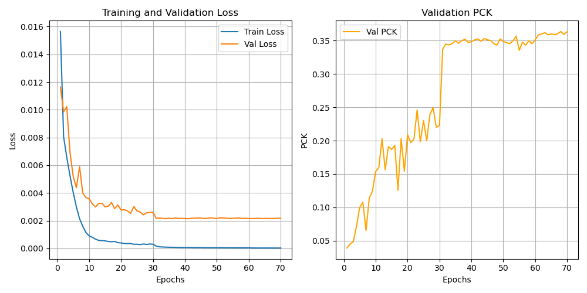
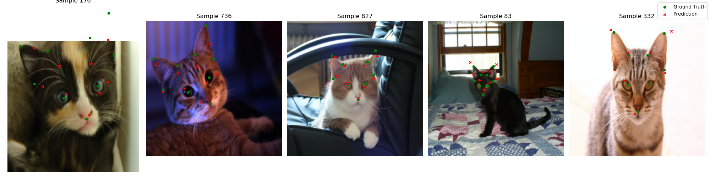
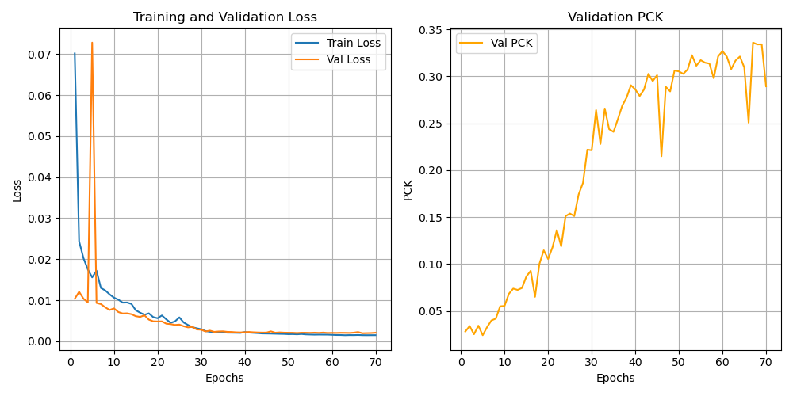
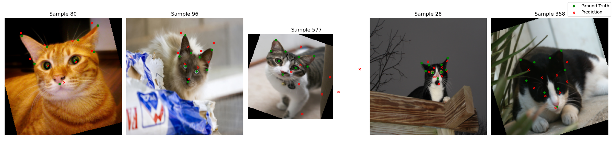
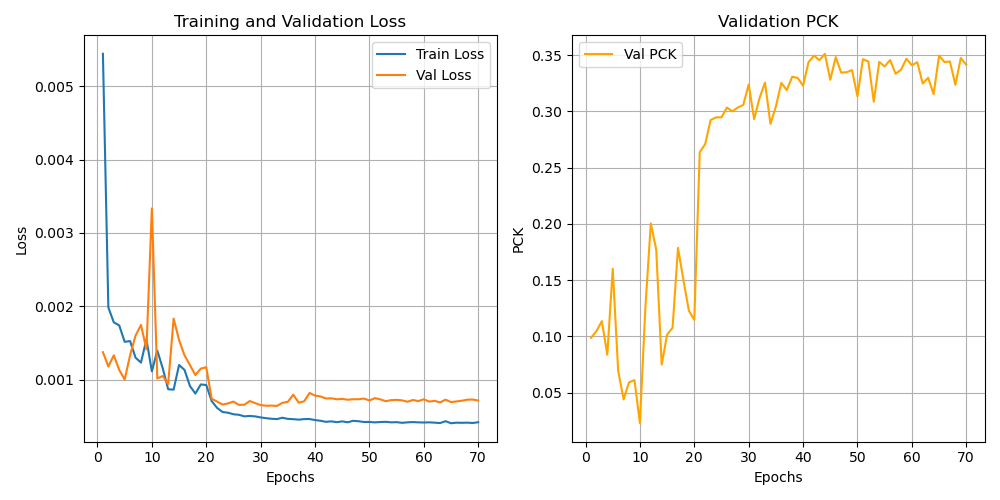
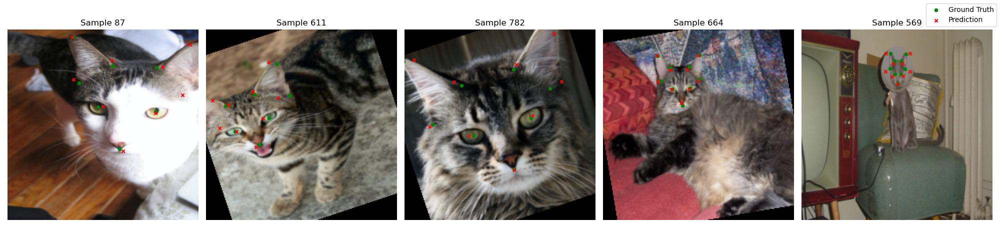
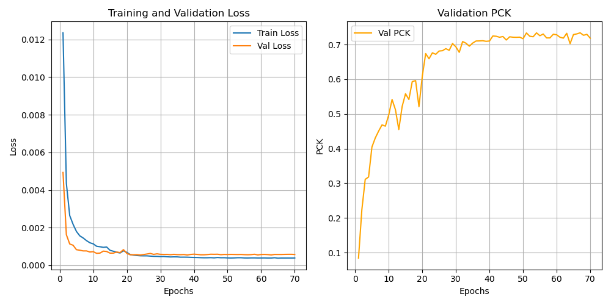
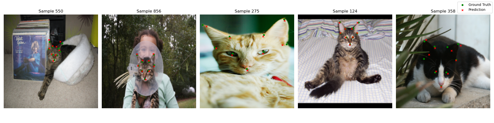
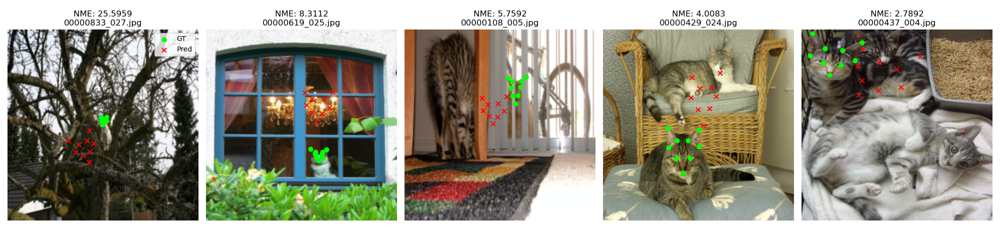
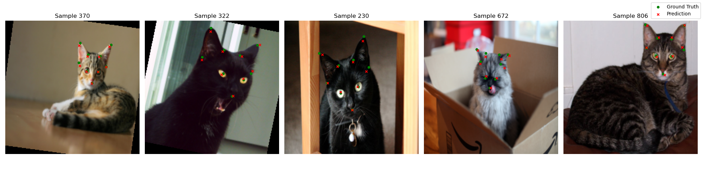

# 🐱 猫脸关键点检测探索日志 (Exploration Log)
**虽然模型最后的效果看上去还可以，但是中途我进行了非常多的结果分析和优化尝试，我总共完整的跑了4次，优化pck指标从35.11%到最终的73.4%**

### 数据预处理与增强 
`dataset.py` 中实现了以下处理管道：
*   **尺寸归一化**: 将所有不同尺寸的原始图片统一缩放到 **224x224** 像素，以匹配 ResNet-50 的输入要求。
*   **标签同步缩放**: 关键点坐标随图片尺寸比例进行变换，并最终归一化到 $[0, 1]$ 区间，加速训练收敛。
*   **在线数据增强**: 训练时引入 **随机旋转 (-30° 到 +30°)**。实际场景中猫的头部姿态非常多变。通过矩阵变换确保旋转后的关键点坐标依然准确。

### 第一次训练：
采用的是resnet-18架构，图像统一缩放到 224x224 像素，并未进行数据增强。
效果如下：

可见：
1.模型虽然学习到了小猫的基本面部特征分布，但存在严重的过拟合问题
2.pck值过低也说明了模型的检测点依然不够准确

### 第二次训练：
*增加：
1.数据增强：在训练时，以 50% 的概率对图像进行 **-30° 到 +30°** 的随机旋转
2.在网络全连接层前增加dropout层
3.选用adam优化器*
**来改善过拟合问题**
效果如下：

可见：
1.解决了过拟合问题
2.模型预测的点和目标点依然有很大差距，效果不好

### 第三次训练：
*增加：
1.直接换网络，采用resnet50，能学到更细的特征，提升精度。初始权重为预训练好的ImageNet权重
2.在网络最后增加sigmoid层，输出被强制压缩在 $(0, 1)$ 之间
**注：其实这里我一开始把图像缩放到448x448，跑了5轮发现效果太差了，我推测resnet50应该和224x224更适配，遂改回224x224***
效果如下（**注意：这里我的alpha选用的0.1，比之前更加严苛**）

可见：
1.在更小的alpha下，pck却和之前差不多，看可视化的效果，精度也大大提升了e-
2.损失函数和pck震荡地太厉害了

### 第四次训练：
*1.调整了学习率：从1e-4调整到2e-5，解决震荡问题
2.将alpha改为0.2*
效果如下：

可见：
1.函数变平稳了
2.精度大大提升了
**效果变好了**
### 在测试集上的评估：
Images Evaluated : 861
PCK @ 0.1        : 74.76%
Mean NME         : 0.22457 (22.46%)
Median NME       : 0.12968 (12.97%)
**相比pck来说，NME的平均值太大了，说明模型的效果还是不够好，但是NME的中位值又是正常的，我推测可能有一部分效果不好的图片拖了很大的后腿**
于是我把NME最低的五张图片可视化
可视化结果如下：

可见：**模型在三类图片下效果较差**
1.猫非常小，两眼间距非常小，根据NME的计算公式，即使差距的像素很小，最终的NME也可能非常大
2.猫被窗框、柱子严重遮挡
3.画面里挤了好几只猫
**于是我进行了数据清理：去除两眼间距 < 10像素的图片**
最终结果如下：
Images Evaluated : 861
PCK @ 0.1        : 76.97%
Mean NME         : 0.16761 (16.76%)
Median NME       : 0.12707 (12.71%)
可视化：
